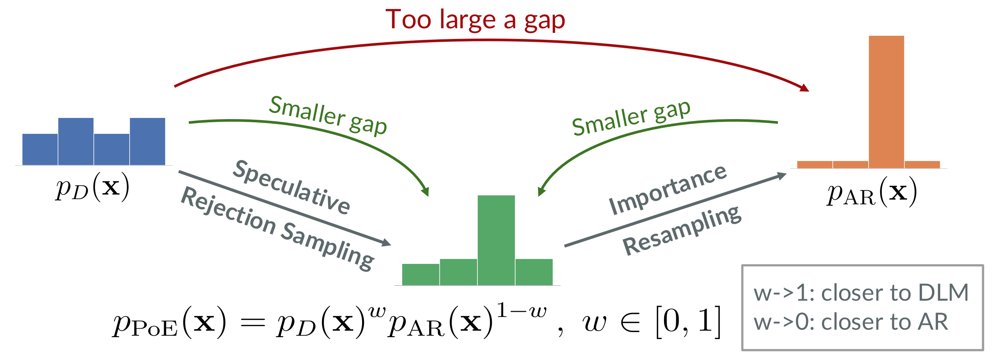
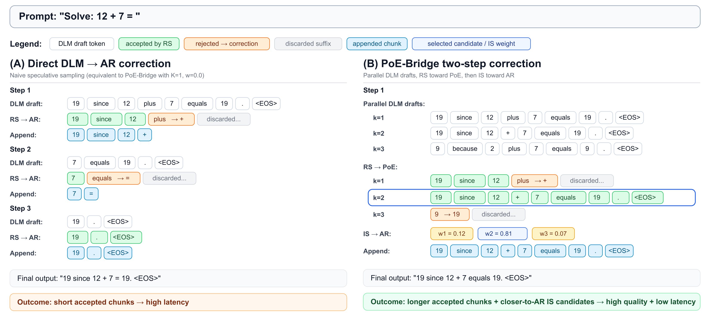

<div align="center">
  
# [ICML 2026] Diffusion Language Model Parallel Decoding via Product-of-Experts Bridge

Juntong Shi $^1$, Brian L. Trippe $^1$, Jure Leskovec $^1$, Stefano Ermon $^1$, Minkai Xu $^1$

**$^1$ Stanford University**

</div>

<p align="center">
  <a href="https://github.com/juntongshi48/poe-bridge/blob/main/LICENSE">
    
  </a>
  <a href="https://openreview.net/forum?id=iA7hUqvsvz">
    
  </a>
  <a href="https://arxiv.org/abs/2606.08048">
    
  </a>
</p>

Official implementation of *Diffusion Language Model Parallel Decoding via Product-of-Experts Bridge* (PoE-Bridge).

## Updates
- [2026.07]：Our code is released!

## Overview

<div align="center">
  
  <p><em>Figure 1: The key idea behind PoE-Bridge.</em></p>
</div>

Diffusion language models (DLMs) enable fast parallel decoding, but their generation quality still lags behind autoregressive (AR) language models. Existing approaches bridge this gap using importance sampling, where the DLM serves as the proposal and the AR model as the target. However, the large discrepancy between their distributions makes importance sampling prohibitively expensive.

PoE-Bridge is an inference-time decoding framework that addresses this challenge by introducing an intermediate Product-of-Experts (PoE) distribution that bridges the DLM proposal and the AR target. Figure 2 illustrates the decoding process on a concrete example. The DLM first drafts multiple continuations in parallel, speculative rejection sampling efficiently moves these candidates toward the PoE distribution, and importance sampling then corrects them to the AR target. By splitting a large distribution correction into two more manageable ones, PoE-Bridge substantially improves both the acceptance rate of rejection sampling and the effective sample size of importance sampling (Figure 1).

We further introduce mixed-temperature sampling to improve diversity and elastic rejection windows to reduce wasted verification, enabling both higher generation quality and faster decoding.

Empirically, PoE-Bridge achieves significantly improved accuracy with $5\times$ speedup over the standard DLM decoding approach, and recovers at least $95\%$ of the target AR model's performance, efficiently advancing most of the quality gap on challenging mathematical reasoning and coding tasks.

<div align="center">
  
  <p><em>Figure 2: An illustrative example of the PoE-Bridge decoding process, compared with speculative decoding using a DLM drafter.</em></p>
</div>

## Dependencies

The required Python packages are listed in [`requirements.txt`](requirements.txt). A simple way to get started is to create a new Conda environment and install the dependencies:

```bash
# Clone the repository
git clone https://github.com/juntongshi48/poe-bridge.git
cd poe-bridge

# Create and activate conda environment
conda create -n poe-bridge python=3.10
conda activate poe-bridge

# Install dependencies
pip install -r requirements.txt
```

## Demo

The easiest way to see PoE-Bridge in action is to run the demo below! The demo presents the full decoding trace in a format similar to Figure 2. The formatted will be available in at `demo_traces/formatted.txt`.

```bash
# Generate the raw decoding traces.
python demo/poe_bridge_demo.py --prompt "Your prompt"

# Format the decoding traces to better visualize them.
python demo/format_demo.py
```

## Repo Structure

```
poe-bridge/
├── configs/                   # Experiment configurations
├── demo/                      # Demonstration scripts
├── demo_traces/               # Demonstration outputs
├── dream/                     # Dream model implementation
│   ├── ...
│   ├── generation_utils.py    # PoE-Bridge decoding algorithm
│   └── ...
├── eval_config/               # Evaluation configurations
├── figures/                   # Paper figures
├── results/                   # Experimental results
├── scripts/                   # Reproduction scripts
├── eval.py                    # Evaluation script
├── harness.py                 # Evaluation harness utilities
├── LICENSE                    # MIT license
├── README.md                  # Repository documentation
├── requirements.txt           # Python dependencies
└── utils.py                    # Shared utility functions
```

## Inference and Evaluation

An example inference and evaluation script is provided in [`scripts/run_poe-bridge.sh`](scripts/run_poe-bridge.sh). The PoE-Bridge decoding configuration can be customized directly in the script. It supports a launch mode for submitting jobs to a Slurm cluster and a mini mode for fast evaluation on a small subset of the data. By default, evaluation results are saved under the `results` directory.

```bash
# Run inference and evaluation.
bash scripts/run_poe-bridge.sh <default|launch|mini> <gsm8k|math|humaneval|mbpp>
```

## License

This work is licensed under the MIT License.

## Acknowledgements
Parts of the decoding algorithm implementation and evaluation pipeline are adapted from the [APD repository](https://github.com/danielmisrael/apd). We thank the authors for making their code publicly available.

## Citation
If you find our work helpful in your research, please consider citing our paper and leaving a ⭐️ on this repo!
```bibtex
@inproceedings{
shi2026diffusion,
title={Diffusion Language Model Parallel Decoding via Product-of-Experts Bridge},
author={Juntong Shi and Brian L. Trippe and Jure Leskovec and Stefano Ermon and Minkai Xu},
booktitle={Forty-third International Conference on Machine Learning},
year={2026},
url={https://openreview.net/forum?id=iA7hUqvsvz}
}
```
## Contact
If you encounter any problem, please file an issue on this GitHub repo.

If you have any question about the paper, please contact Juntong at [juntong@stanford.edu](mailto:juntong@stanford.edu) or Minkai at [minkai@stanford.edu](mailto:minkai@stanford.edu).